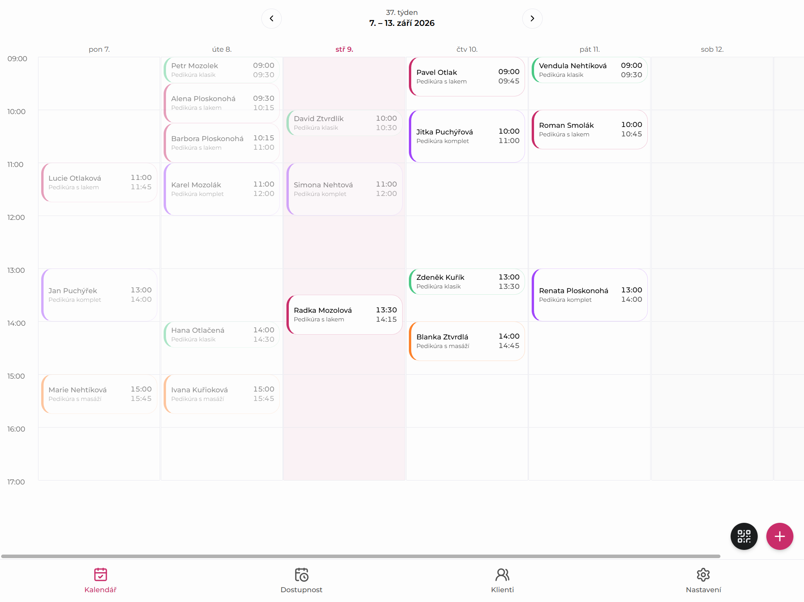
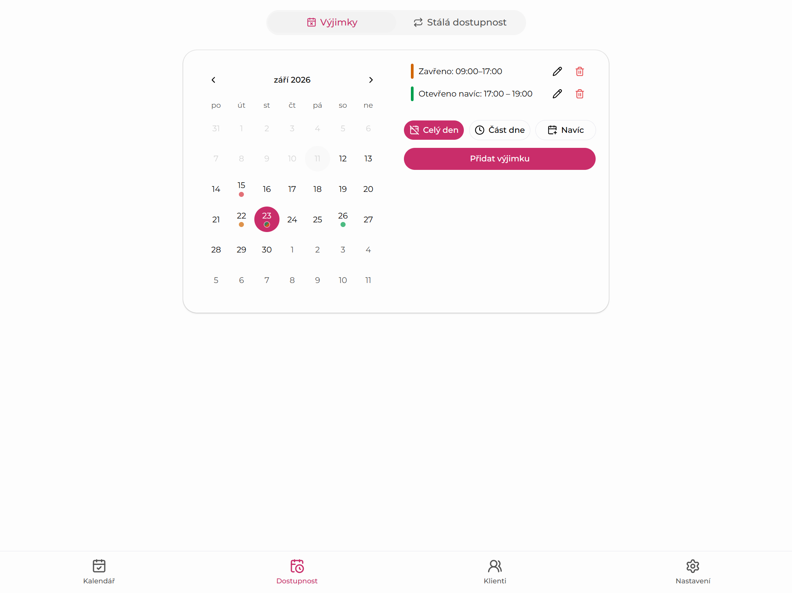
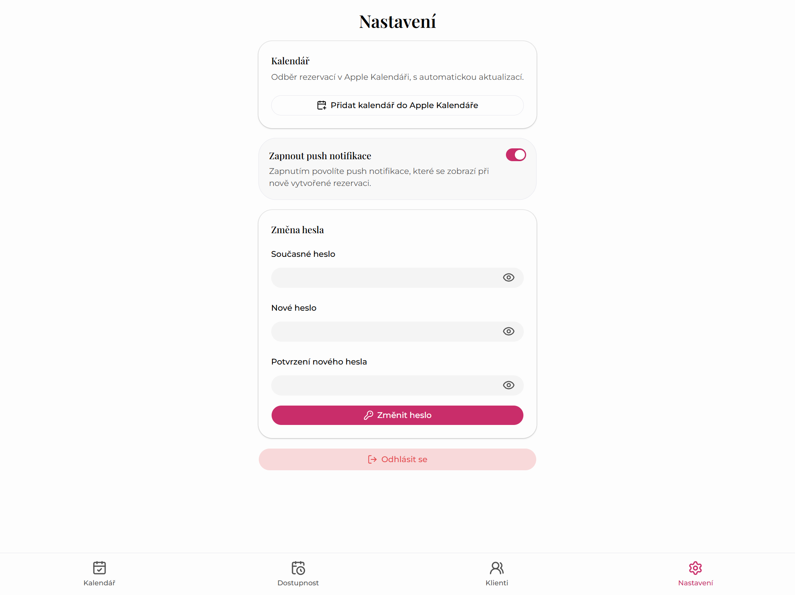
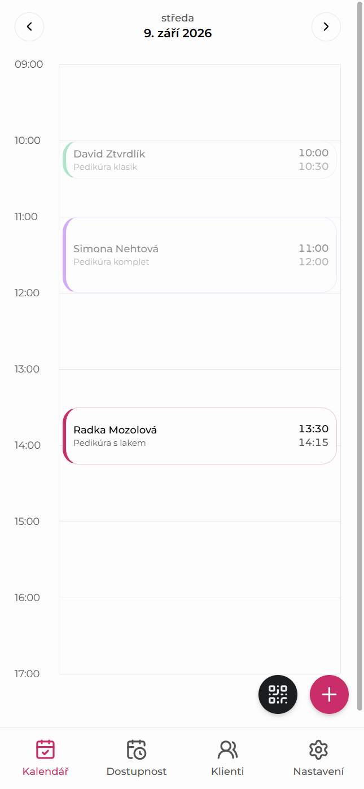

# Nohy v cajku – Pedicure Booking Platform

A full production system for a home-based pedicure business: marketing site, a
no-signup client booking flow, and a mobile-first admin panel for the sole
practitioner – built end to end (schema, business logic, UI, deployment) as a
real, currently-live application, not a demo.

**Live:** [www.pedikurakralovice.cz](https://www.pedikurakralovice.cz)

## What it does

- **Marketing site** – homepage, pricing, contact, SEO (host-aware
  `robots.txt`, sitemap, LocalBusiness structured data).
- **Client booking** – solo and group (2-4 people) bookings with no account
  required, magic-link self-service cancel/reschedule, email confirmation,
  SMS reminder on the day.
- **Admin panel** (own subdomain) – calendar, availability rules with
  one-off exceptions, client list, and push notifications on new bookings –
  built mobile/tablet-first since it runs on a tablet at the shop.

## Screenshots

The admin panel lives on its own login-gated subdomain, so here's what it
actually looks like (sample data, tablet width unless noted):

<table>
<tr>
<td width="50%">

**Weekly calendar**

</td>
<td width="50%">

**Availability & exceptions**

</td>
</tr>
<tr>
<td width="50%">

**Settings – push notifications**

</td>
<td width="50%">

**Day view (mobile)**

</td>
</tr>
</table>

## Notable features

- **Group booking with race-condition-safe slots.** Solo or group (2-4
  people) bookings, no account needed. Concurrent attempts at the same slot
  are resolved by a database-level uniqueness constraint, so two people
  can't ever double-book the same time.
- **Self-service via magic link.** Clients can cancel or reschedule their
  own booking from a link in their confirmation email – no login, no app.
- **Push notifications.** The practitioner gets notified on her phone/tablet
  (installed as a PWA) for every new booking, cancellation, or reschedule,
  plus a daily schedule summary and low SMS-credit alerts.
- **SMS reminders** sent automatically on the day of the appointment through
  a real SMS gateway, with credit-balance monitoring so reminders never
  silently stop going out.
- **One-way calendar sync** – bookings show up in Apple Calendar via a
  subscribed ICS feed, no manual copying.
- **Admin panel on its own subdomain**, built mobile/tablet-first since it
  runs on a tablet at the shop: calendar, availability rules with one-off
  exceptions, and a client list.
- **SEO-aware marketing site** with host-based `robots.txt`/sitemap and
  local-business structured data.

## Stack

Next.js 16 (App Router) · TypeScript · PostgreSQL + Prisma · Auth.js
(credentials + argon2, DB-revalidated JWT sessions) · Tailwind + shadcn/ui ·
Resend + react-email · Web Push (`web-push`) · Vercel (hosting + Cron) ·
Neon (branch-per-environment: dev/test/production) · Vitest (DB integration
tests against an isolated branch)

## Status

Fully built and deployed. Client-facing booking is feature-complete but
gated behind a single flag (`lib/booking-enabled.ts`) until the
practitioner's real weekly availability is entered – flipping it restores
both the `/rezervace` route and every "Book now" CTA at once.
